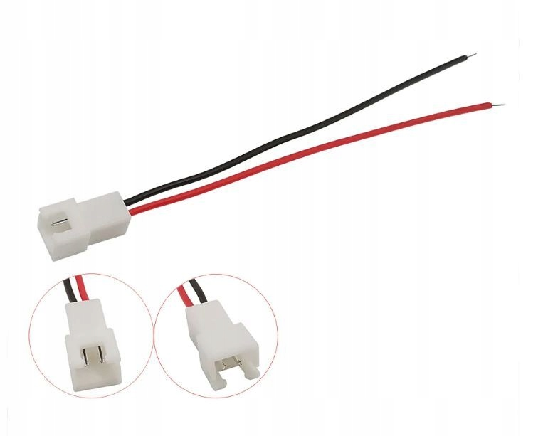

## Анализ и планирование

Ниже следует инженерная часть проекта, содержащая расчёты, технико-конструктивные 
решения и принципы построения. Эта информация не обязательна для сборки: вы можете 
пропустить её и перейти сразу к инструкциям, списку компонентов и порядку сборки.

Тем не менее, если вы планируете модифицировать устройство, адаптировать под свои 
задачи или просто хотите понять, почему были выбраны именно такие компоненты, — 
эта часть будет полезной. Ведь прежде чем что-либо строить, полезно задуматься 
о реализуемости проекта и способах достижения цели.

## Исходные данные и расчёт для агитационной машины

Начнём с основного — размеров и массы бачков. Большинство моделей с герметичной  
крышкой, представленных на рынке, имеют цилиндрическую форму диаметром от 95 до  
115 мм. Длина в зависимости от ёмкости колеблется от 150 мм (односпиральные) до  
350 мм (на 5 плёнок). Есть модели на 8 плёнок — до 450 мм длиной. Такая длина велика
и выходит за разумные габариты, потому мы оставим ее как возможность инженерной 
версии, а конструировать будем на максимальный размер 350 мм с возможностью апгрейда. 

Объём раствора — от 350 мл до 2 литров. Таким образом, полная снаряжённая масса 
бачка — от 500 г до 3 кг. Горизонтальная агитация не требует полного заполнения, 
но для расчётов мы закладываем массу с запасом — это повышает надёжность при любых условиях.

Бачок должен вращаться под собственным весом на роликовом приводе. Поскольку  
размеры могут значительно различаться, вращение должно осуществляться через  
несколько опорных колёс. Следовательно, требуется ось достаточной длины и  
жёсткости для обеспечения устойчивости. 

Готовых колёс с посадкой на ось в продаже нет — их придётся изготавливать 
самостоятельно. Это ограничивает минимальный диаметр. Чем больше колесо, тем 
выше момент инерции и сложнее запуск — своего рода компромисс между стабильностью 
и динамичностью системы. Поверхность колес должна обеспечивать надёжное сцепление — 
предпочтительно использовать резину или силикон. Принимаем диаметр ведущего 
колеса (с учётом шины) равным примерно 40 мм. Меньше — предпочтительно, 
больше — нежелательно.

Закладываем запас мощности двигателя — 40% 
(рабочая нагрузка: не более 60% от номинала). Это не инженерная 
перестраховка, а практическая необходимость — двигатель должен уверенно 
запускаться даже при неблагоприятных условиях и сохранять стабильность работы 
на протяжении всего процесса проявки.

### Исходные данные:

- Масса бачка с раствором: ≈ 1.7 кг (бачок + 1 литр раствора)  
- Диаметр бачка: ≈ 95 мм  
- Диаметр ведущего колеса: ≈ 40 мм  
- Частота вращения бачка: ~1 об/3–4 с → ~15–20 об/мин  
- Частота вращения колеса:  

$\frac{d_{\text{бачка}}}{d_{\text{колеса}}} \times f_{\text{бачка}} = \frac{95}{40} \times 0.25 \approx 0.6$ об/с  
  → ≈ 35–40 об/мин
 
- Оптимальная загрузка двигателя: ≈ 60% от номинала

### Оценка требуемого момента:

Главная нагрузка — преодоление трения и момента инерции.

Оцениваем силу трения (коэффициент трения "резина–пластик" ≈ 0.7):

$F_{\text{тр}} = \mu \times m \times g \approx 0.7 \times 1.7$ кг $\times 9.8$ м/с² $\approx 11.7$ Н

Рассчитаем момент на колесе (радиус 20 мм = 0.02 м):

$M = F_{\text{тр}} \times R = 11.7$ Н $\times 0.02$ м $\approx 0.234$ Н·м

С учётом КПД (условно 80%):

$M_{\text{двигателя}} \approx 0.234 / 0.8 \approx 0.293$ Н·м = 29.3 N·cm

Это — пиковый момент, необходимый для уверенного запуска. В рабочем режиме  
потребуется ≈ 15–20 N·cm. Именно момент на колесе определяет, справится ли двигатель с запуском.

С учётом запаса 40%:

29.3 N·cm — это 60% → номинал ≈ 29.3 / 0.6 ≈ 48.8 N·cm

Аналогичный расчет для пиковой нагрузки - 3 кг показывает мощность **≈ 51.45 N·cm**

**Вывод:**
Двигатель должен обеспечивать номинальный крутящий момент не менее **51.45 N·cm**,  
чтобы гарантировать уверенный старт и стабильную работу с типичным фотобачком.
Уменьшение диаметра колес снизит требования, но может повлиять на стабильность 
вращения — еще один пример баухаусского принципа баланса между формой и функцией.

Из доступных на рынке шаговых двигателей наилучшим выбором является:

**17HS19-2004S1**
- Тип: NEMA 17, биполярный шаговый
- Ток фазы: 1.5–2.0 A
- Номинальный момент (холдинг): ≈ 0.59 N·m
- Угол шага: 1.8° (стандарт)

### Управление двигателем и цепи питания

Теперь, когда мы определились с требованиями к двигателю, рассмотрим особенности 
управления и питания системы. Для питания используется адаптер на **12 В**, 
мощностью **не менее 3 А**, а лучше **4 А** — с учётом пусковых токов, которые могут 
в 2-3 раза превышать номинальные значения при старте системы.

Рекомендуется стандартный адаптер с индикацией питания:

> **Switching Power Supply Lighting Transformer AC 110V~220V to DC 12V 4A**  
> Разъём: **DC 5.5×2.1 мм, "male connector"**

**Управление двигателем** — модульное, на основе драйвера для шаговых двигателей 
типа **NEMA 17**, с программированием с передней панели и встроенной индикацией.  
Оптимальный вариант:

> **SMC02 Stepper Motor Driver and Controller (DC 10–30V, 4A, Reverse, Programmable, 
> PLC, Serial Control)**

**Защита цепи питания** — автомобильный предохранитель 12 В, 3 А ATC. Это не просто 
формальность, а важный элемент безопасности, особенно при работе с жидкостями:

> **Inline fuse + fuse holder, "medium-sized automotive"**

**Охлаждение**: двигатель и драйвер в работе греются, особенно при длительных сессиях. 
Требуется **вытяжной вентилятор** для поддержания оптимального температурного режима:

> **40×40×10 мм (4010), 12 В, 2-pin, малошумный, бесщёточный**

Рекомендуется дополнительно:

- **Металлическая решётка**: 40 мм, стандартная — защищает от случайного контакта.
- **Кнопки**:
  - Вентилятор: **KCD1-108R (rocker switch, с проводами)** — интуитивно понятное управление.
  - Контроллер: **SPST 20 мм, 12 В, mini round switch (с уже обжатыми проводами)** — 
    удобно при работе в перчатках.

**Подключение вентилятора**:  
> Разъём **JST XH 2.54, 2-pin**, шаг 2.54 мм — стандартное решение, обеспечивающее 
> надежное соединение и возможность быстрой замены.

### Распределение нагрузки

Бачок опирается сразу на **две параллельные оси с роликами**, а вес распределяется 
между двумя точками опоры, уменьшая нагрузку на каждую. Это работает подобно тому, 
как две руки легче удерживают тяжёлый предмет, чем одна — такое распределение 
не только снижает нагрузку, но и значительно повышает стабильность системы.

Упрощённая модель:

- Расстояние между осями образует **хорду круга** (диаметра бачка)
- Радиус бачка образует **прямоугольный треугольник** с этой хордой
- Угол α между вертикалью и вектором к точке опоры:

$\cos(\alpha)=\frac{\text{половина расстояния между осями колёс}}{\text{радиус бачка}}$

Тогда сила на каждую ось:

$F_{\text{на ось}}=\frac{F_{\text{общая}}}{2 \cdot \cos(\alpha)}$

Это создаёт **механический выигрыш по нагрузке**, а благодаря **жёсткости конструкции 
и поверхностному трению** возникает дополнительный **резерв устойчивости** — 
система становится более стабильной и предсказуемой.

## Габариты и геометрия

Переходя от расчетов к конкретной геометрии устройства, обратимся к основным 
размерам, которые определяют конструкцию в целом:

- **Максимальная длина бачка**: 350 мм — стандарт для бачков на 5 плёнок
- Оптимальные **точки опоры**: ⅓ от краёв → осевая длина ≈ 200 мм
- +2×8 мм подшипники + муфта → **длина оси ≥ 220 мм**  
  (стандарт резки: 250 мм)

### Боковая устойчивость

Важный аспект конструкции — обеспечение устойчивости бачка при вращении:

- Бачок должен находиться **достаточно глубоко**, чтобы не соскользнуть при работе
- **Ведущая ось**: расположена чуть выше свободной → создаёт прижим + распределяет нагрузку  
  (в представленном прототипе: перепад = 1 мм, допускается до 5 мм)

### Расстояние между осями

Правильное расстояние между осями критично для стабильной работы:

- Бачок ≈ 100 мм, колёса 40 мм → оптимальное межосевое расстояние: **≈ 95 мм**
- Это даёт:
  - достаточный прижим для надежного сцепления
  - избегание "закусывания" при вращении
  - устойчивость даже при неидеальной геометрии бачка

### Подшипники

Для надежной работы важны правильно расположенные опоры:

- Подшипники: ширина **по 55 мм** — обеспечивают устойчивость осей
- Минимальная **ширина всей конструкции**: **150 мм** — оптимальный баланс между 
  компактностью и устойчивостью

### Длина конструкции

Общие габариты определяются исходя из функциональных требований:

- Двигатель + муфта + подшипник: 100 мм
- Бачок: до 350 мм
- Общая длина основания: **не менее 450 мм** — обеспечивает устойчивость и возможность 
  работы с бачками разного размера

### Корпус

Корпус — это не просто защитная оболочка, а функциональный элемент, воплощающий 
баухаусский принцип "форма следует за функцией". Он обеспечивает:

- жёсткость конструкции, устраняя нежелательные колебания
- влагозащиту и безопасность при работе с химическими растворами
- естественную вентиляцию для отвода тепла

Форма: куполообразная крышка с вертикальными стенками — сочетание эстетики и 
функциональности.

Элементы конструкции:

- Разъём питания и предохранитель — на тыльной стороне, вдали от зоны контакта 
  с раствором
- Вентилятор и защитная решётка — в задней части, обеспечивают вытяжку воздуха 
  из-под купола
- Нижние зазоры — обеспечивают естественный приток воздуха снизу и отвод жидкости 
  при случайном затоплении

### Кинематика привода

Передача движения от двигателя к бачку — ключевой элемент конструкции, требующий 
особого внимания:

Двигатель соединяется с валом через  муфту:
D20L25 (5×8 мм) — Aluminium Plum Coupling (4-jaw), Flexible CNC Stepper Shaft Coupler

Ведущий вал:

- Материал: нержавеющая сталь — устойчива к коррозии и обладает высокой жёсткостью
- Диаметр: 8 мм — оптимальный баланс между прочностью и весом
- Длина: 250 мм — стандартный размер для резки
- Тип: Stainless Steel Solid Round Rod — легко доступен в магазинах метизов

Оба конца вала закреплены в самоустанавливающиеся подшипниковые блоки:
KP08 Pillow Block Bearing — обеспечивает компенсацию перекосов и лёгкую сборку.

⚠️ **Примечание**: пружинная муфта допускает радиальное и угловое смещение,
но при старте и торможении вызывает осевую нагрузку (сжатие/растяжение),
приводящий к нежелательному износу двигателя. Учитывайте это при расчётах ресурса.

Свободно вращающаяся ось сконструирована аналогично.

Колёса:
- Основание: жёсткие фланцевые втулки — 8 mm Rigid Flange Coupling
- Рабочая поверхность: кольца из резины или силикона, надеваемые на заготовку

### Несущая конструкция

Выбор алюминиевого профиля не случаен — он обеспечивет жесткость, модульность и визуальную чистоту 
конструкции. Рама выполнена на основе алюминиевого профиля 20-й серии (T-slot, системный).

Основные элементы:

- Моторная площадка: профиль 20×100 мм, длина 150 мм — обеспечивает устойчивость двигателя
- Поперечная стойка: профиль 20×40 мм, длина 150 мм — создаёт жёсткость конструкции
- Продольные лонжероны: профиль 20×20 мм, длина 400 мм — формируют основу каркаса

Дополнительные компоненты:

- Резиновые антивибрационные опоры — ANTI-VIBRATION RUBBER FEET 2020 (4 шт.) — 
  снижают передачу вибрации и шума
- Заглушки торцевые для профиля 20×20 — 4 шт и 20x40 - 3шт. — придают законченный внешний вид
- Молдинг (профиль-заглушка пазов) — Slot Cover Seal Profile Flat 2020, длина 4 м — 
  улучшает эстетику и предотвращает скопление пыли

Все соединения выполняются с использованием стандартных болтов М5, обеспечивая 
сборно-разборную жёсткую структуру, которую легко модифицировать и адаптировать 
под индивидуальные потребности.

В следующей части мы перейдём от проектирования к сборке — перечислим компоненты, 
опишем порядок действий и предложим рекомендации по наладке.