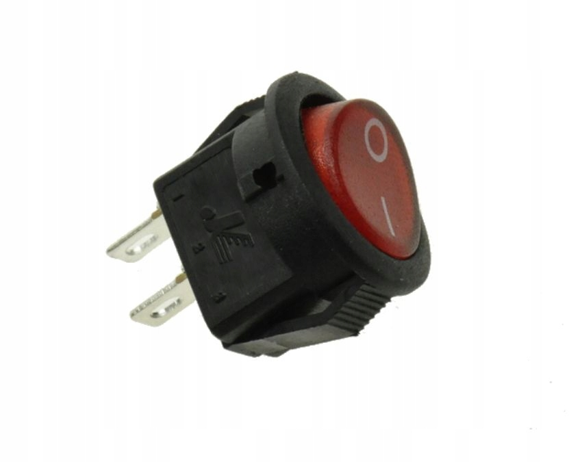
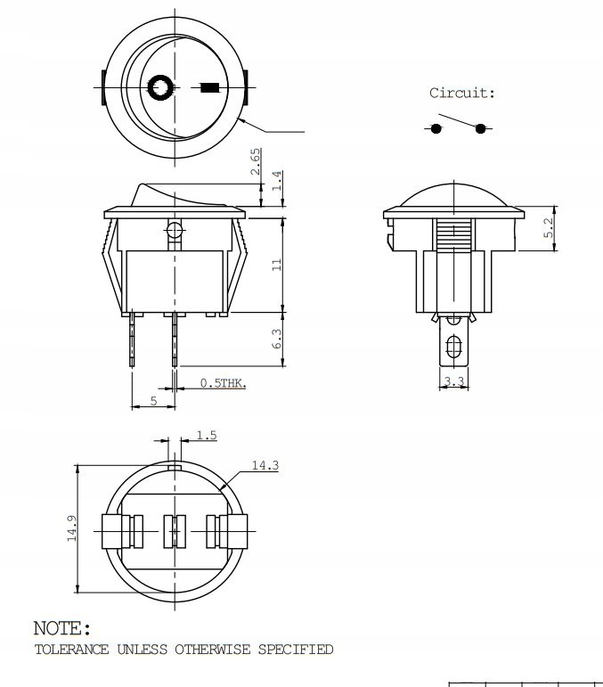
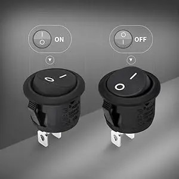
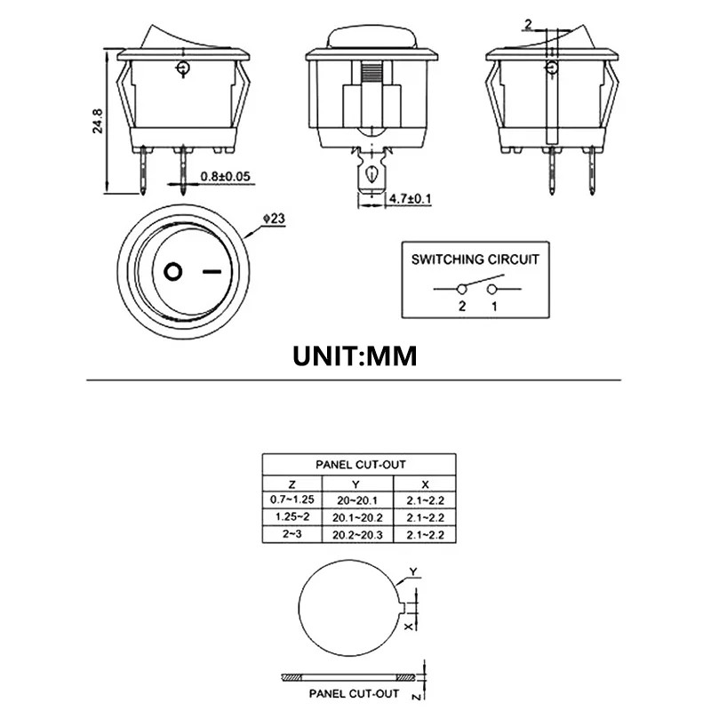
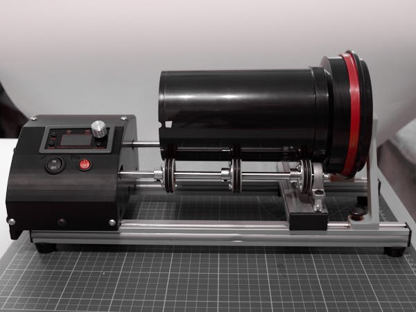
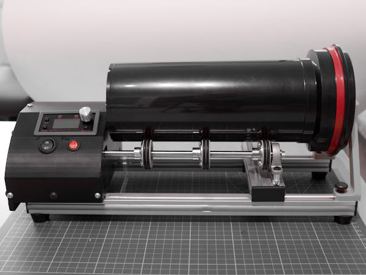
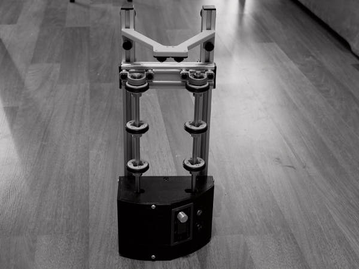

# Введение: время, инструменты и подход

Конструкция агитатора построена с минимальным числом компонентов.  
Пайка, где необходимо, выполняется с использованием термоусадочной трубки с припоем.

Если вы хотите избежать ручного обжима клемм, можно использовать готовые  
обжатые провода (*pre-crimped wires*). Для этого потребуются:

- 2 провода с обжатыми клеммами **4.6 mm** (*тип 4.6F / 4.8F*) на концах,
- 4 провода с обжатыми клеммами **6.3 mm** (*тип 6.3F*) на концах.

Используйте их вместо отрезков, которые в инструкции предполагается обжимать вручную.  
При необходимости соединяйте провода с помощью термоусадочной трубки с припоем —  
в соответствующих разделах будет указана альтернатива обжиму.

Если у вас есть уверенные навыки пайки, вы можете отказаться от клемм и термотрубок  
в пользу прямых паяных соединений.

Во всех узлах конструкции используются винты с внутренним шестигранником (allen/hex socket)
и стандартной метрической резьбой.

    **Винты M5х10** — Винты низкопрофильные с внутренним шестигранником (3 мм),
    используемые в системах V-Slot / T-Slot / OpenBuilds.
    Головка — цилиндрическая, плоская, высота ≈ 1.5 мм.
    Это специальный тип винтов, адаптированный под канавки алюминиевых профилей,
    и часто обозначается как "Low Profile Screw M5 for V-Slot".

    Винты M4 и M3 — допускаются как обычные ISO 7380, так и с пресс-шайбой
    (вариант с шайбой предпочтителен, если крепёж идёт по пластику)

    Шайбы и гроверные шайбы — стандартные плоские шайбы DIN 125A
    и гроверные (пружинные) шайбы DIN 127
    (гровер — это разрезная шайба, предотвращающая откручивание)

    Проставочные шайбы (Distance Sleeve) высотой 6 мм и 8 мм,
    внутренний диаметр — 5 мм, внешний — 10 мм.
    Используются для компенсации высоты между подшипниками, валами и корпусом.

**Примерное время сборки**

- **Опытный пользователь с практикой 3D-проектов**: 4–5 часов  
- **Фотолюбитель с базовым DIY-опытом**: 6–8 часов  
- **Новичок без инструмента и опыта**: до 15 часов, разбитых на 2–3 сессии

Инструкции ориентированы на пользователя без опыта проектной сборки  
средней сложности. Владельцы уверенных навыков могут опустить часть  
пояснений и использовать шаги как каркас реализации.

## Модификации устройства: Molo-M и Molo-L

Существует две модификации конструкции:  
**Molo-M** (стандартная) и **Molo-L** (удлинённая).

Обе версии используют одинаковые двигатель, контроллер и крепления.  
Основные различия касаются длины валов, размеров платформы и числа опорных элементов.

| Модификация | Вместимость | Длина валов | Кол-во колёс на валу | Длина лонжеронов |
|-------------|-------------|-------------|------------------------|----------------|
| Molo-M      | до 5 плёнок | 250 мм      | 3                     | 400 мм          |
| Molo-L      | до 8 плёнок | 350 мм      | 4                     | 500 мм          |

**Важно:** Для перехода с M на L необходимо:
- заменить оба вала на более длинные;
- установить увеличенные лонжероны;
- напечатать дополнительное колесо на каждый вал;
- использовать более длинную платформу (если применимо).

**Прочие параметры — без изменений.**  
Контроллер, двигатель и охлаждение подходят для обоих вариантов.

# Полный список компонентов для сборки агитатора

## Механические компоненты
### Профильные элементы и крепления
- Алюминиевый профиль 20×100 мм, длина 150 мм (моторная площадка) — 1 шт.
- Алюминиевый профиль 20×40 мм, длина 150 мм (поперечная стойка) — 1 шт.
- Алюминиевый профиль 20×20 мм, продольные лонжероны (longitudinal rail/belka wzdłużna) — 2 шт.  
  - Для Molo-M: длина 400 мм  
  - Для Molo-L: длина 500 мм
- Уголок на три винта — 2 шт.
- Двухвинтовые уголки — 2 шт.
- L Type Bracket Mount NEMA 17 Stepper Motor Holder — 1 шт.
- Молдинг (Slot Cover Seal Profile Flat 2020) — 1 шт.
  - Для Molo-M: длина 4 м
  - Для Molo-L: длина 5 м

### Валы и вращающиеся элементы
- Вал нержавеющая сталь 8 мм, длина 250 мм — 2 шт.
  - Для Molo-M: длина 250 мм  
  - Для Molo-L: длина 350 мм
- Блок подшипниковый KP08 — 4 шт.
- Муфта D20L25 (5×8 мм) — Aluminium Plum Coupling (4-jaw), Flexible — 1 шт.

### Резиновые и защитные элементы
- Ножки виброгасящие для профиля 2020 (ANTI-VIBRATION RUBBER FEET 2020 LEGS) — 4 шт.
- Силиконовые бамперы (Silicone cabinet bumpers/Rubber Furniture Pads) 2×5 или 3×8 мм — 4+ шт.
- Резиновые кольца OD38 мм, CS3.1 мм 
  - Для Molo-M: 12 шт  
  - Для Molo-L: 16 шт

### Винты, гайки и крепежные элементы
- Гайка профильная пружинная M5 — 35 шт.
- Гайка профильная пружинная M4 — 8 шт.
- Винт M5×10 — 24 шт.
- Винты ручной затяжк GB834 DIN 464 M5×12 - 2шт 
- Винт M5×25 (ISO 7380) — 8 шт.
- Винт M4×8 — 10 шт.
- Винт M4×13 — 24 шт.
  - Для Molo-M: 24 шт  
  - Для Molo-L: 32 шт
- Винт M3×8 — 4 шт.
- Винт M3×10 — 8 шт.
- Винт M3×15 — 4 шт.
- Шайба M5 — 20 шт.
- Проставочные шайбы  (Distance Sleeve) M5×6 — 8 шт.
- Проставочные шайбы  (Distance Sleeve) M5×8 — 8 шт.
- Шайба M5×1 (обычная стальная) — 2 шт.
- Шайба M4 — 8 шт.
- Шайба M3 — 4 шт.
- Гровер M3 — 4 шт.
- Гайка M3-A2 DIN 929 (толщина 3 мм) — 4 шт.

### Резьбовые вставки
- Резьбовые вставки M4×L4×OD5.
  - Для Molo-M: 30 шт  
  - Для Molo-L: 38 шт
- Резьбовые вставки M3×L4×OD4.2 — 10 шт.

## Электронные компоненты
### Двигатель и контроллер
- Двигатель 17HS19-2004S1 — 1 шт.
- Контроллер SMC02 Stepper Motor Driver and Controller — 1 шт.

### Система охлаждения
- Вентилятор 40×40×10 мм (4010), 12 В, 2-pin, малошумный, бесщёточный, с разъёмом JST XH 2.54 мм — 1 шт.
  (4010 fan (40×40×10 mm), 12V, 2-pin, low-noise, brushless, with JST XH 2.54 mm connector — 1 pc.
   Wentylator 4010 (40×40×10 mm), 12V, 2-pin, cichy, bezszczotkowy, z wtyczką JST XH 2.54 mm — 1 szt.)
- Вентиляторная решётка 40 мм — 1 шт.

### Выключатели и питание
- Переключатель вентилятора KCD1-108R (KCD1-108R-12V) (rocker switch) — 1 шт.
  (Убедитесь, что используется именно 12-вольтовая версия переключателя в противном случае световая индикация работать не будет)
   
  
- Переключатель питания контроллера SPST 20 мм (mini round switch) — 1 шт.
  
  

- Адаптер питания 12В, 4A с разъёмом DC 5.5×2.1 мм — 1 шт.
- Предохранитель автомобильный 12В, 3А ATC с держателем (Inline fuse + fuse holder) — 1 шт.

### Провода и коннекторы
- Красные и чёрные провода соответствующей длины
- Wire Connector 6.3F — несколько штук
- Cover 6.3S — несколько штук
- Разъём JST XH 2.54, 2-pin — 1 шт.
- Термоусадочная трубка (опционально)

## 3D-печатные компоненты
### Основные детали
- Заготовки колес (Wheel.stl) 
  - Для Molo-M: 6 шт  
  - Для Molo-L: 8 шт.
- Заготовка стопора (TankLimiter.stl) — 1 шт.
- Правая боковая стенка (RightWall.stl) — 1 шт.
- Левая боковая стенка (LeftWall.stl) — 1 шт.
- Верхняя крышка (TopCover.stl) — 1 шт.
- Фиксаторы платы контроллера (ControllerPCB_Fixer.stl) — 2шт по необходимости

## Дополнительные компоненты
### Колёсные опоры
- Шариковые опоры 26 мм (размер-S) (Self Adhesive Caster Wheels 360 size-S) — 2 шт.

### Расходные материалы
- Изолента или матерчатая фотолента
- Суперклей (опционально)
- Изопропиловый спирт (опционально, для промывки платы)

## Необходимые инструменты
- Отвёртка крестовая 
- Г-образные шестигранные ключи 1.5, 2, 2.5, 3, 4 мм
   (англ. L-shaped hex/Allen keys, польск. klucze imbusowe L)
- Обжимные клещи 10–26 AWG (crimping pliers)
- Паяльник (возможно потребуется)
- Нож канцелярский для подрезки изоленты
- Кусачки для проводов
- Устройство для вплавления резьбовых вставок (паяльник или специальный инструмент)
- Линейка или штангенциркуль (200мм)

# Внешний Molo/M в сборе

**Агитатор с бачком на 3 плёнки (стопор придвинут):**

**Агитатор с бачком на 5 плёнок (стопор отодвинут):**

**Агитатор в вертикальном положении для хранения:**

**Сборка завершена.** 

