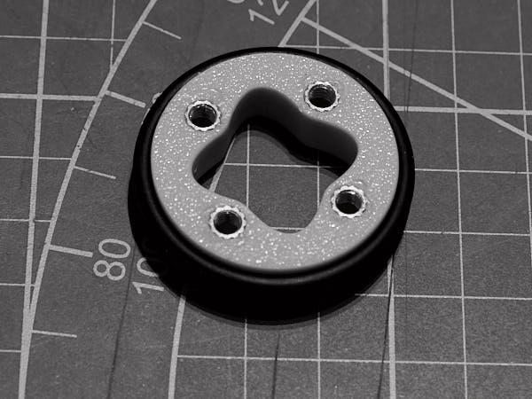

## Сборка колес

Понадобятся:
вставки M4xL4xOD5 24шт
винты M4х13 24шт
резиновые кольца OD38mm CS3.1 12шт

В отпечатанные заготовки вплавляем резьбовые вставки M4xL4xOD5
Надеваем резиновые кольца
Вставки прикручиваем к фланцам винтами и тщательно затягиваем винты

