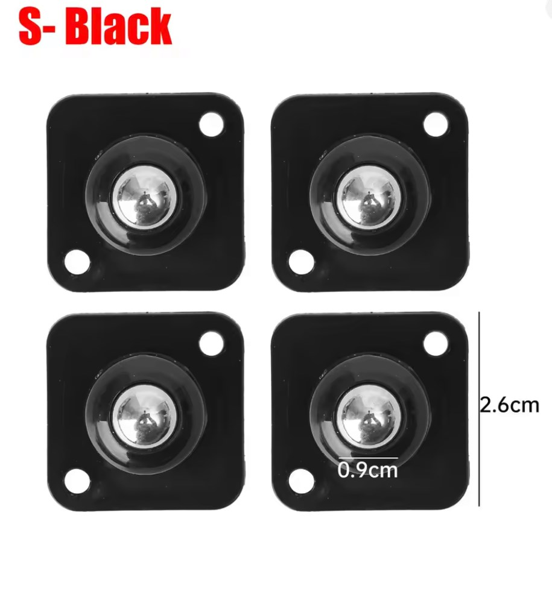

## Сборка колёс

Понадобятся:

- Резьбовые вставки **M4×L4×OD5** — 24шт.  
- Винты **M4×13** — 24шт.  
- Резиновые кольца **OD38мм**, **CS3.1мм** — 12шт.
- Отпечатанные заготовки колес Wheel.stl - 6шт

1. В отпечатанные заготовки вплавьте резьбовые вставки **M4×L4×OD5**.  
2. Наденьте резиновые кольца на рабочую поверхность заготовок.  
3. Прикрутите заготовки к фланцам винтами **M4×13**, тщательно затяните.

> ⚠️ Убедитесь, что вставки зашли строго перпендикулярно —  
> это влияет на сборку. Винты не закрутятся в перекошанные втулки.

## Сборка стопора
Понадобятся:

- Винт **M3×10** — 4 шт.
- Резьбовые вставки **M3×L4×OD4.2** — 4 шт.
- отпечатанная заготовка TankLimiter.stl
- Шариковые опоры 26mm (размер-S) (Self Adhesive Caster Wheels 360 size-S) - 2шт
  

1. В отпечатанную заготовки вплавьте резьбовые вставки **M3×L4×OD4.2**.  
2. Наденьте резиновые кольца на рабочую поверхность заготовок.
  

3. Закрепите роликовые опоры винтами
  
