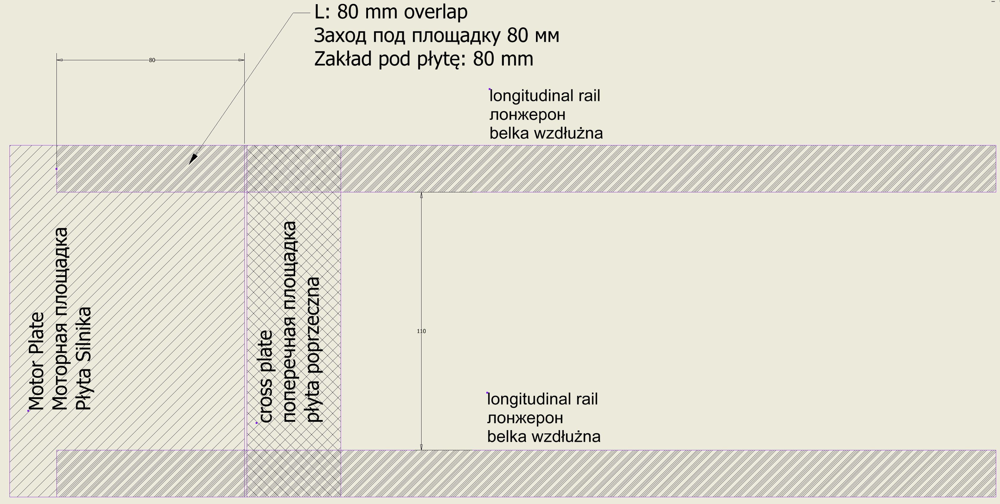
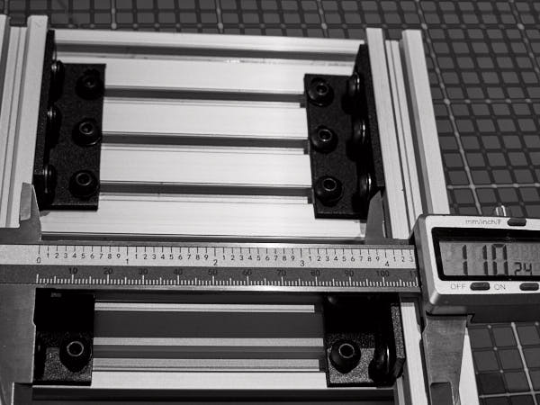

# Сборка рамы

Сборка рамы — один из ответственных этапов. Требуется максимально  
соблюсти прямоугольность конструкции. Очень важно выдержать параллельность  
максимально точно. На этом этапе не стоит туго затягивать крепёж — достаточно,  
чтобы детали плотно соединялись друг с другом. Настройка относительного  
положения элементов будет производиться в самом конце сборки.

1. Прикрутите уголок к моторной площадке так, чтобы он занял три центральных паза  
   алюминиевого профиля (всего их пять; крайние останутся свободными).  
   ⚠️ Не затягивайте винты слишком туго — конструкция должна оставаться подвижной. 
2. К вертикальной стороне уголка (той, что направлена вверх,  
   если площадка лежит горизонтально), прикрутите продольный лонжерон.
   Совместите его торец с краем уголка — это обеспечит нужный заход  
   под площадку примерно на 80 мм.
3. Сдвиньте весь лонжерон, используя свободу в креплении, так чтобы его торец  
   совпал с торцом моторной площадки.  
   В этом положении площадка будет точно опираться на лонжерон  
   по всей ширине — без выступа за край.
4. Повторите операцию для второго лонжерона, закрепив его на противоположной стороне.
5. Установите **стопор** на дальних концах лонжеронов — он обеспечит точное  
   расстояние между ними.
6. Приложите **поперечную площадку** к торцу моторной площадки так, чтобы  
   срезы профилей совпадали.

   

7. Закрепите её **двухвинтовыми уголками**. При необходимости скорректируйте  
   положение лонжеронов.
8. После выравнивания затяните винты уголков на поперечной площадке.  
   Винты крепления лонжеронов оставьте слегка ослабленными.
9. Снимите стопор и проверьте параллельность, передвинув площадку к краям  
   лонжеронов.
10. Верните поперечную площадку назад — вплотную к моторной — и слегка затяните винты,  
    обеспечив неподвижность.

### Понадобятся:

- Гайка профильная **M5** — 20шт.  
- Винт **M5×10** — 20шт.  
- Шайба **M5** — 20шт.  
- Уголок на три винта —  
  _Triple Universal L Type Support Bracket for 20 Series Aluminium Profiles_ — 2шт.  
- Уголок на два винта —  
  _Double Universal L Type Support Bracket for 20 Series Aluminium Profiles_ — 2шт.

### Резюме:

- Крепим уголки к продольным профилям  
- Крепим профили к основанию, максимально выдерживая прямоугольность  
- Допускается отклонение не более **0.3мм**  
- Перемычка сначала крепится вплотную, позже будет установлена точно по месту

В этом положении будет производиться установка подшипников и их настройка  
по соосности с валом двигателя.