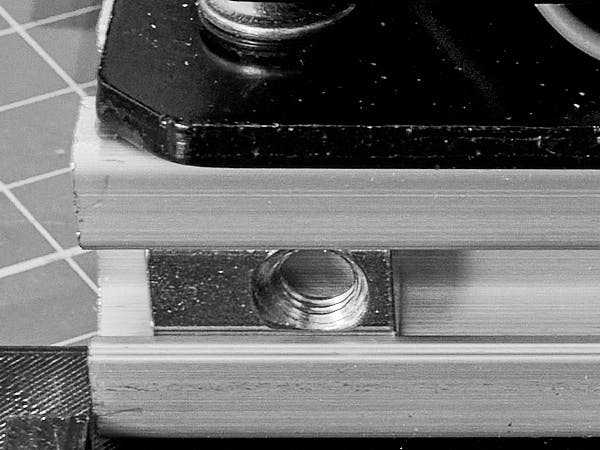
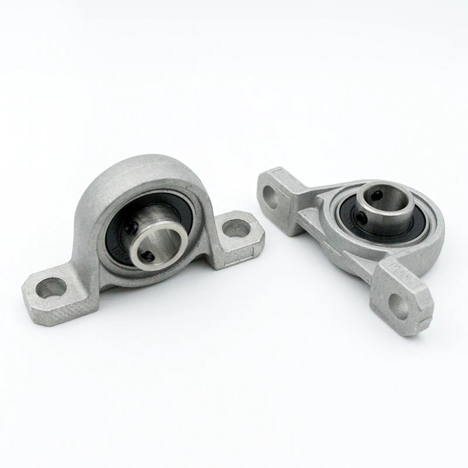
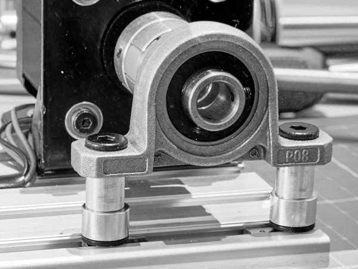
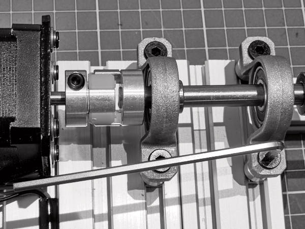

## Монтаж двигателя и подшипниковых узлов KP08
### Установка крепления двигателя

Первым делом монтируем крепление двигателя.

**Понадобятся:**

- Гайка профильная **M4** — 4шт.  
- Винт **M4×8** — 4шт.  
- Шайба **M4** — 4шт.  
- Кронштейн:  
  *L Type Bracket Mount NEMA 17 Stepper Motor Holder*

Край крепления должен отстоять примерно на **3мм** от торца площадки и выступать  
на **2мм** за её край. Старайтесь соблюдать параллельность краям моторной площадки.

Затяните винты надёжно.

### Установка двигателя

**Понадобятся:**

- Гайка профильная **M4** — 4шт.  
- Винт **M3×8** — 4шт.  
- Шайба **M3** — 4шт.  
- Гровер **M3** — 4шт.  
- Вал 8мм 250мм - 1шт
- Двигатель **17HS19-2004S1** — 1шт.  
- Муфта **D20L25 (5×8 мм)** —  
  *Flexible 4-jaw Aluminium Plum Coupler*

Установите муфту на вал двигателя и затяните крепёжный винт.  
Установите двигатель в кронштейн и закрепите винтами **M3** с шайбами и гроверами.
Если ввы используйте двигатель **17HS19-2004S1** установите его так чтобы выход
проводов был направлен к основанию.

### Установка подшипниковых блоков

**Понадобятся:**

- Гайка профильная пружинная **M5** — 8шт.  
- Винт **M5×25** — 8шт.  
- Шайба **M5×6** — 8шт.  
- Шайба **M5×8** — 8шт.  
- Шайба **M5×1** — 2шт. (обычная стальная шайба)  
- Блок подшипниковый **KP08** — 4шт.

Установите два блока со стороны двигателя на три шайбы:  
**1мм**, **6мм**, **8мм** — на моторную и поперечную площадки.

⚠️ Обратите внимание на ориентацию винтов — они должны быть направлены **от двигателя**.

Не затягивайте крепёж — оставьте блокам подвижность вдоль пазов.  
Смещайте блоки до совпадения отверстий: вал должен свободно проходить сквозь муфту  
**без закусываний**. Проверяйте отверстия на совпадения просовывая вал и смещая блоки 
в нужную сторону. После настройки затяните винты.

На противоположной стороне установите блоки на шайбы **4мм** и **8мм**  
(без шайбы 1мм). Край блока должен располагаться **точно над краем платформы**  
(расстояние от края до центра отверстия ≈27мм).

Центровка здесь не требуется — блоки **самоустанавливающиеся**.

- Винты на блоке со стороны **моторной** площадки — затянуть плотно.
- Винты на блоке с **поперечной** стороны — зафиксировать, но не затягивать полностью.

