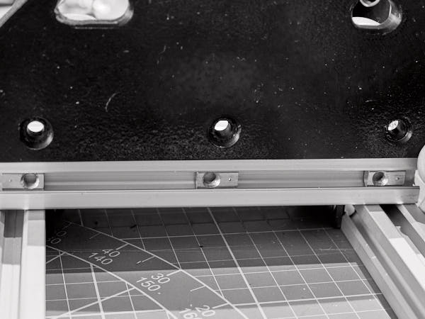
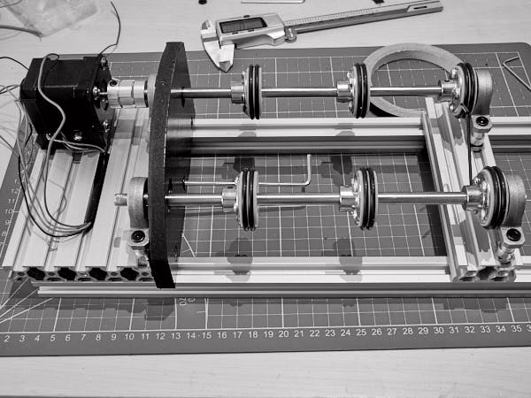

# Монтаж боковой стенки

## Монтаж колёс на валы

**Понадобятся:**
- Вал 8мм, 250мм — 2шт.
- Колёса в сборе — 6шт.

Наденьте на каждый вал по 3 колеса так, чтобы крепления фланцев были ориентированы в  
сторону двигателя. Сдвиньте все колёса к середине вала и слегка затяните крепления,  
чтобы они не слетали. Допустимо закрепить крайние колёса, а центральное оставить  
свободным.

## Подготовка правой боковой стенки

**Понадобятся:**
- Резьбовые вставки **M4×L4×OD5** — 3шт.
- Изолента или матерчатая фотолента
- Боковая стенка `RightWall.stl`

В торец стенки вплавьте резьбовые вставки **M4×L4×OD5**. Проклейте торец стенки  
изолентой или фотолентой. Срежьте излишки с краёв острым ножом. Вырежьте отверстия  
там, где установлены резьбовые вставки.

## Установка шайб в платформу двигателя

**Понадобятся:**
- Гайка профильная пружинная **M5** — 3шт.
- Подготовленная стенка `RightWall.stl`

Ослабьте винты поперечной платформы и отодвиньте её к краю лонжеронов на расстояние  
больше длины вала.

Вставьте гайки в торцевой профиль моторной площадки. Приложите стенку и  
спозиционируйте гайки по отверстиям. Примерьте, надевается ли стенка на торец  
площадки — она должна свободно устанавливаться. Если нет — слегка доработайте пазы,  
процарапав пластик острым ножом. (Профили нарезают с допуском ±0.4мм, запаса посадки  
торцевой стенки может не хватить). Приложив стенку, убедитесь, что гайки и отверстия  
совпали. При необходимости сдвиньте гайку в нужное положение ножкой ключа.

## Установка валов

**Понадобятся:**
- Винт **M5×10** — 3шт.
- Валы с надетыми колёсами
- Рама с двигателем
- Подготовленная стенка `RightWall.stl`

Проденьте валы сквозь отверстия в стенке. Просуньте вал через подшипниковый блок в  
муфту и затяните фиксирующий винт на муфте. Просуньте второй вал в свободную муфту на  
моторной площадке. Оставьте примерно 2мм вала и затяните фиксирующие винты на муфтах.

Сдвиньте поперечную площадку так, чтобы её муфты наделись на валы. Оставьте небольшой  
вылет. Свободно вращающийся вал будет выступать примерно на 5мм дальше, чем вал,  
подключённый к двигателю — это нормально.

Затяните винты крепления поперечной площадки к лонжеронам — площадка примет положение,  
параллельное моторной площадке.

Установите на место стенку и закрепите её на торце моторной площадки винтами  
**M5×10**. Затяните винты крепления вала у подшипниковых блоков на поперечной  
площадке.

