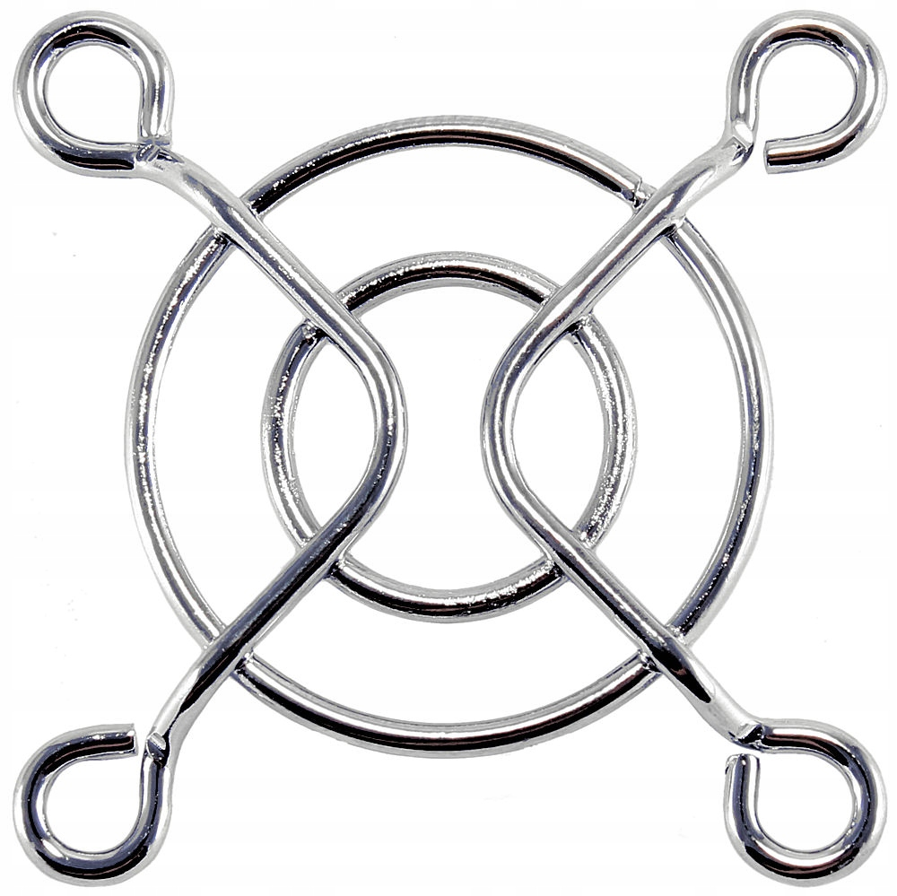
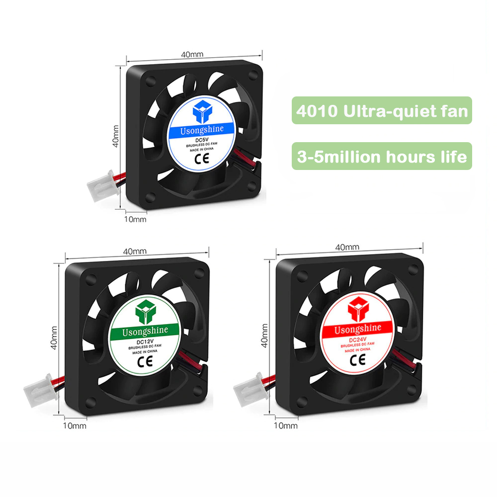
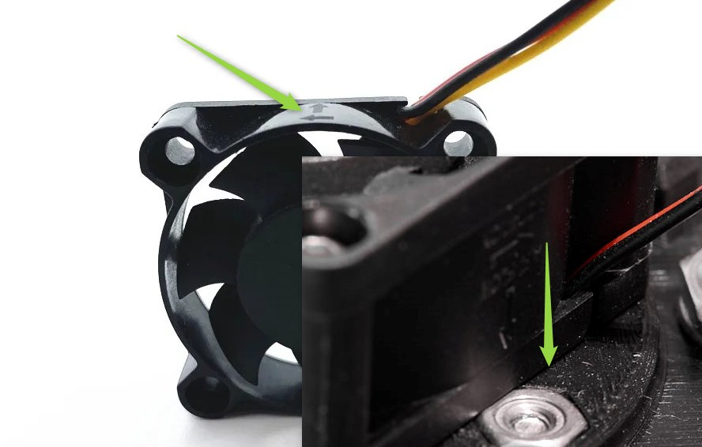
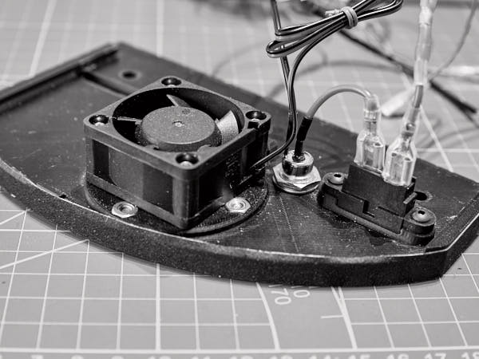
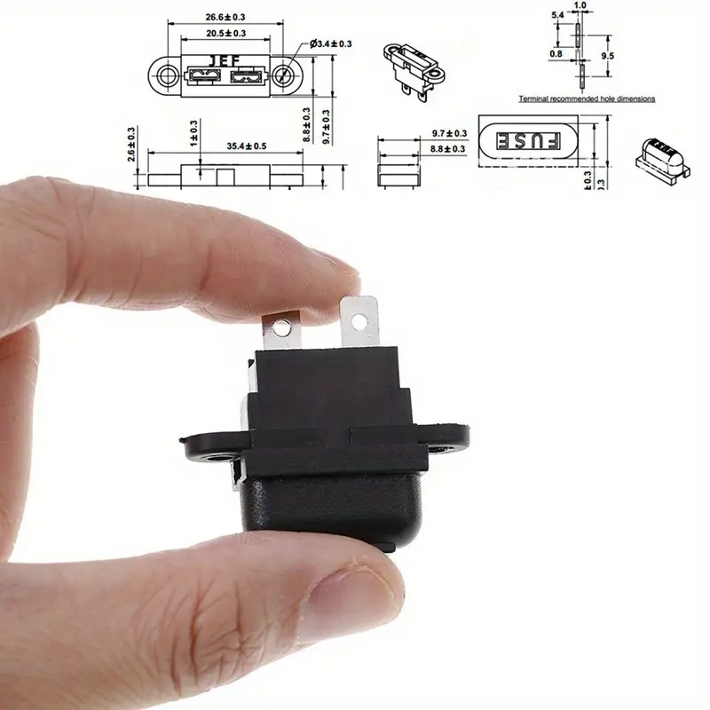
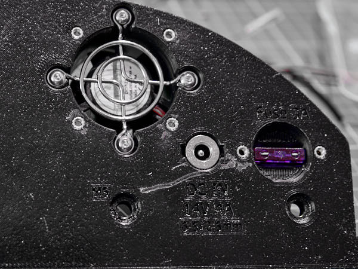
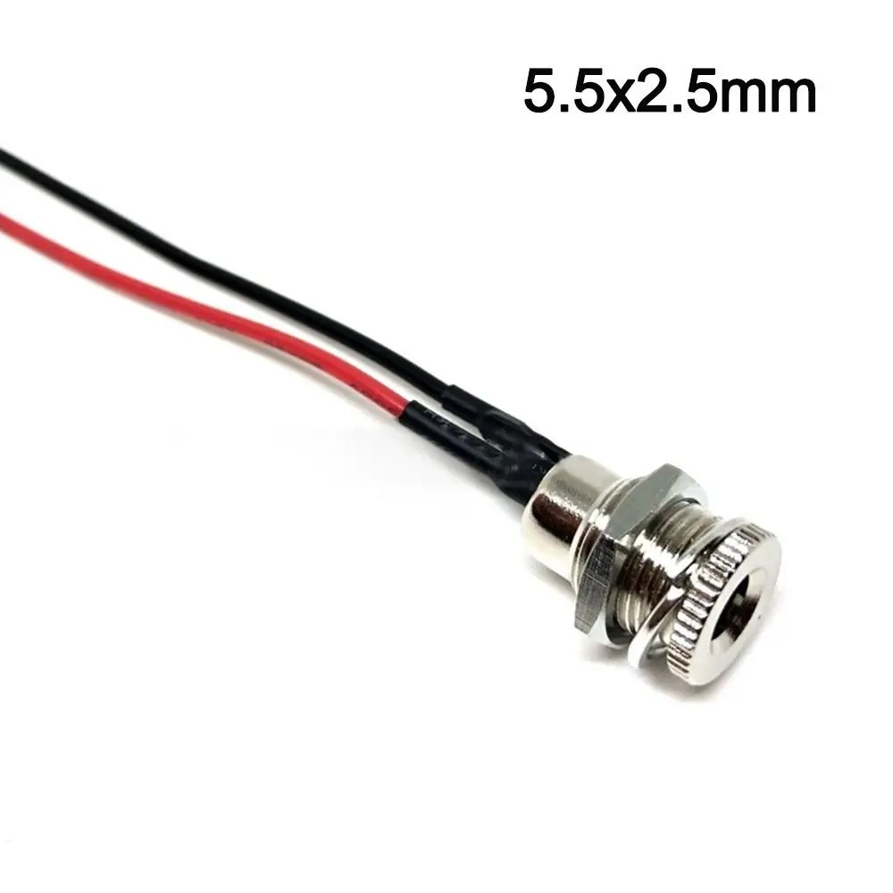

## Сборка левой стенки

### Подготовка левой боковой стенки

Операция аналогична подготовке правой боковой стенки.

**Понадобятся:**
- Резьбовые вставки **M4×L4×OD5** — 3 шт.
- Изолента или матерчатая фотолента
- Боковая стенка `LeftWall.stl`

В торец стенки вплавьте резьбовые вставки **M4×L4×OD5**. Проклейте торец стенки  
изолентой или фотолентой. Срежьте излишки с краёв острым ножом. Вырежьте отверстия  
там, где установлены резьбовые вставки.

### Подготовка к установке навесных элементов

**Понадобятся:**
- Резьбовые вставки **M3×L4×OD4.2** — 6 шт.
- Боковая стенка `LeftWall.stl`

В торец стенки вплавьте резьбовые вставки **M3×L4×OD4.2**. Следите, чтобы вставки  
встали ровно. Убедитесь, что винты закручиваются легко. Если нет — повторно нагрейте  
и аккуратно выровняйте. Пользуйтесь вкрученными винтами для корректировки положения.

### Установка решётки вентилятора

**Понадобятся:**
- Винт **M3×10** — 4 шт.
- Гайка **M3-A2 DIN 929** (толщина 3 мм) — 4 шт.
- Подготовленная стенка `LeftWall.stl`
- Вентиляторная решётка: 40 мм  
  

Установите гайки в пазы на внутренней стороне стенки. Решётка устанавливается с  
внешней стороны заподлицо. Закрепите решётку винтами, плотно затянув.

### Установка вентилятора

**Понадобятся:**
- Винт **M3×15** — 4 шт.
- Подготовленная стенка `LeftWall.stl`
- Вентилятор 40×40×10 мм (4010), 12 В, 2-pin  
  

Установите вентилятор с внутренней стороны крышки так, чтобы воздушный поток 
направлялся **наружу** корпуса. 

На корпусе вентилятора направление потока указано стрелками.

Закрепите вентилятор винтами **M3×15**.

⚠️ На иллюстрации ошибочно изображён вентилятор 40×40×20 мм (4020). Он не подходит —  
управляющему контроллеру не хватит места!

### Установка блока предохранителей

**Понадобятся:**
- Винт **M3×10** — 2 шт.
- Подготовленная стенка `LeftWall.stl`
- Блок предохранителей  
  

Установите блок в монтажное гнездо и закрепите винтами **M3×10**, надёжно затянув.
Установите предохранитель 3A в предохранительный блок.

### Монтаж разъёма 12 В

**Понадобятся:**
- Подготовленная стенка `LeftWall.stl`
- 5.5×2.5 мм с кабелем: Female DC Socket  
  

Установите разъём в гнездо. Закрепите гайкой без чрезмерного усилия.

### Подготовка к монтажу проводки

**Понадобятся:**
- Подготовленная стенка `LeftWall.stl`
 
Подрежьте красный провод так, чтобы его хватило до предохранителя с запасом примерно 2см.  
Отрежте черный провод оставив 1/3 длины.
Снимите разъём внешнего питания со стенки.

Он понадобится на следующем этапе при подготовке проводки.
