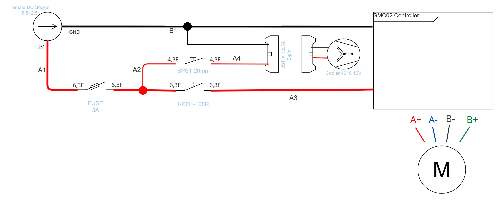
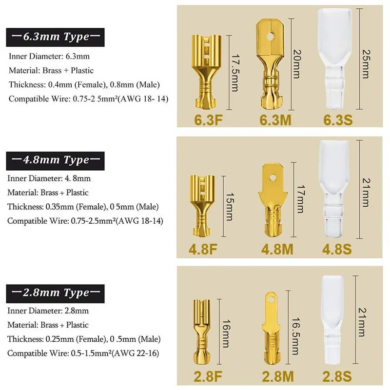
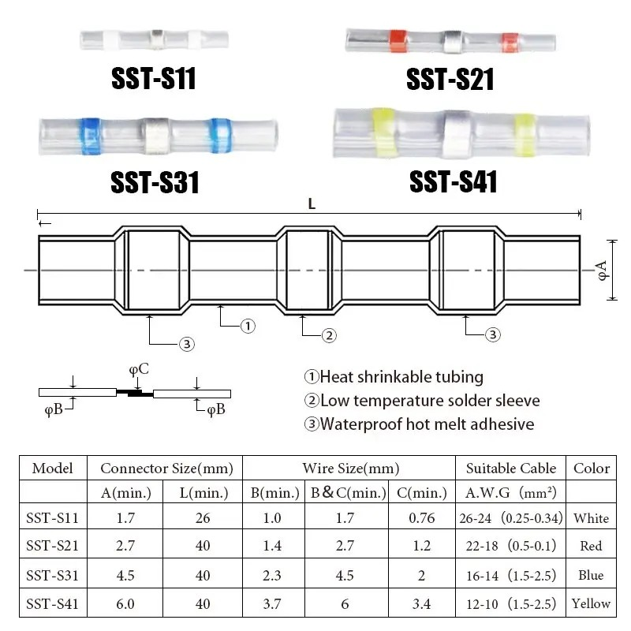
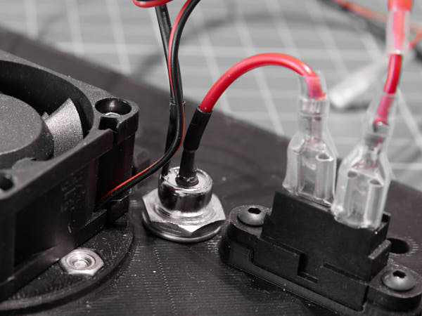

## Подготовка проводки

Общая электрическая схема устройства представлена ниже. Для удобства она  
разделена на участки: **A1**, **A2**, **A3** и **B1**. Это позволит пошагово  
подготавливать проводку и избежать путаницы при подключении компонентов.

На схеме:

- **Чёрным цветом** обозначен провод **земли (GND)**  
- **Красным цветом** — провод **питания +12 В**  
- Толщина линии соответствует **условной толщине проводов**: провод от разъёма  
  питания — **более толстый**, провод к вентилятору — **тоньше**
- Обозначения **6.3F** и **4.3F** — это **типоразмеры клемм**, которыми соединяются  
  провода с компонентами (предохранитель, кнопки, контроллер)
- Названия компонентов и разъёмов указаны **голубым цветом**

> 💡 Размеры клемм подобраны специально: 6.3F и 4.3F физически несовместимы,  
> чтобы исключить ошибочное подключение. Это облегчает сборку и повышает  
> надёжность.

Проводку будем собирать **последовательно**, по каждому из участков — от  
простых к более сложным. При аккуратной работе и минимальных ошибках длины  
отрезков провода из комплекта должно хватить с запасом.

### Участок A3

**Понадобятся:**  
- Отрезок красного провода  
- Обжимные клещи 10–26 AWG (crimping pliers)  
    
- Wire Connector 6.3F — 1 шт.  
- Cover 6.3S  
    

Если колпачка нет — используйте подходящую термоусадочную трубку.

У отрезанного от разъёма провода один конец уже подготовлен — зачищен и залужен.  
Отрежьте 6 см (длина с запасом) от подготовленного конца провода.  
Снимите 4 мм изоляции с противоположного конца.  
Наденьте изоляционный колпачок 6.3S (см. рисунок).  
Обожмите клемму 6.3F клещами.  

Если вместо колпачка использована трубка — надвиньте её на клемму и усадите феном.  
Пользоваться зажигалкой не рекомендуется: обычный бытовой фен на максимальном  
нагреве и минимальных оборотах даёт достаточную температуру, если поднести его  
очень близко к термоусадке. Не обожгите пальцы — температура воздуха на выходе  
из фена может достигать 100°C.  

Возможно, с первого раза не получится. Аккуратно разогните клемму и повторите  
операцию. Зачищенный провод выдержит примерно 3 попытки. После этого нужно  
снова зачистить провод — запаса длины должно хватить.

### Участок A1

**Понадобятся:**  
- Снятый 5.5×2.5 мм с кабелем: Female DC Socket с подкороченными проводами  
- Обжимные клещи (10–26 AWG)  
- Wire Connector 6.3F — 1 шт.  
- Cover 6.3S — 1 шт.  

Снимите 4 мм изоляции с красного провода.  
Наденьте изоляционный колпачок 6.3S или термоусадочную трубку, как на участке A3.  

⚠️ Важно: Перед обжимом обязательно наденьте колпачок — после обжима это будет невозможно. 

Обожмите клемму 6.3F клещами.

### Участок A4

**Понадобятся:**
- Подготовленная стенка `LeftWall.stl` с установленным вентилятором  
- Разъём **JST XH 2.54, 2-pin**, шаг 2.54 мм  
  
- Обжимные клещи (10–26 AWG)  
- Wire Connector 4.3F — 1 шт.  
- Cover 4.3S — 1 шт.  

⚠️ **Осторожно: возможна перепутанная полярность проводов вентилятора.**  
Цвет проводов не всегда соответствует полярности. У некоторых вентиляторов 
чёрный может оказаться плюсом, а красный — минусом.

Перед пайкой или подключением убедитесь, что:  
- **Контакт +12 В** вентилятора совпадает с **VCC на разъёме JST**
- **GND вентилятора** попадает на **землю (GND)** на плате

Ориентируйтесь **по маркировке на корпусе вентилятора или документации.**
Даже если маркировка есть выполните временное подключение вентилятора через  
предохранитель чтобы убедиться в его работоспособности.

Поскольку участок A1 уже подготовлен, его можно подключить к предохранителю до  
установки в стенку. Подключите адаптер к Female DC Socket и проверьте запуск.
Если вентилятор не вращается поменяйте подключение красного и черного проводов.
После проверки отключите адаптер. Разберите временное соединение.

Не паяйте и не обжимайте финально, пока не уверены в полярности и работоспособности вентилятора.

Укоротите провода **JST XH 2.54, 2-pin** на половину длины.  
Снимите 8 мм изоляции с провода питания (того, который на пробном запуске  
был подключен к предохранителю).  
Наденьте изоляционный колпачок 4.3S или термоусадочную трубку, как  
на участке A3.  
⚠️ **Важно:** если вы забудете надеть колпачок — придётся срезать клемму.

**Разъём 4.3F великоват для провода вентилятора.**  
Сложите оголённый провод вдвое перед обжимом — это улучшит контакт.  

Обожмите клемму 4.3F клещами.

### Участок B1
**Понадобятся:**

- Разъём **JST XH 2.54, 2-pin**, шаг 2.54 мм, с обжатой клеммой на красном проводе питания  
- Разъём **5.5×2.5 мм Female DC Socket с кабелем**, обжатая клемма на красном проводе  
- **Термоусадочная трубка с припоем** (solder-seal connector, тип SST-S31 AWG 14–16)  
  
- Отрезок чёрного провода (тот, что остался от разъёма DC)

Снимите 5 мм изоляции с трёх концов:
- Чёрного провода от **Female DC Socket**
- Чёрного провода от разъёма **JST XH**
- Отрезка чёрного провода, оставшегося от обрезки

**Порядок соединения:**

1. Наденьте термоусадочную трубку SST-S31 на чёрный провод от разъёма DC.  
   Расположите трубку так, чтобы оголённый участок оказался строго под центральным  
   кольцом припоя.
2. Вставьте с другой стороны чёрный провод от JST и оставшийся отрезок провода.  
   Совместите жилы так, чтобы они перекрывали друг друга в центре трубки — под зоной  
   припоя.
3. Прогревайте трубку **средством с широкой подачей тепла** (строительный фен или  
   мощный бытовой). Начинайте с центра (где припой) и двигайтесь к краям.  
   Наблюдайте:  
   - Припой должен расплавиться и обволочь жилы.  
   - Концы трубки должны плотно сесть на изоляцию, образуя герметичный узел.
4. Дайте остыть (5-6 минут), слегка потяните за провода — соединение должно быть прочным.

⚠ **Важно:**  
- Не используйте паяльник или зажигалку — можно перегреть изоляцию.  
- Если спайка не удалась с первого раза — разрежьте трубку и повторите на новом  
  участке.

В результате вы получили соединение без пайки, но с прочным электрическим и  
механическим контактом и надёжной герметизацией. 

*Если вы пользуетесь паяльником не забудьте надежно изолировать место пайки термоусадочной трубкой, желательно с клеем.

### Участок A2

**Понадобятся:**

- **Термоусадочная трубка с припоем** (solder-seal connector, тип SST-S31 AWG 14–16)  
  
- Отрезок красного провода (тот, что остался от разъёма DC)
- Отрезок тонкого красного провода (тот, что остался от **JST XH 2.54, 2-pin**)
- Обжимные клещи (10–26 AWG)  
  
- Wire Connector 6.3F — 2 шт  
- Cover 6.3S — 2 шт  
- Wire Connector 4.3F — 1 шт  
- Cover 4.3S — 1 шт  

**Подготовка:**

1. Тонкий красный провод: зачистите один конец и обожмите клеммой 4.3F, как в  
   **участке A4**. Наденьте колпачок **Cover 4.3S** (он легко теряется, не откладывайте).  
   Если необжатый конец залужен — обрежьте его и зачистите 5 мм изоляции заново.

2. Толстый красный провод: зачистите оба конца и обожмите клеммами **6.3F**, как в  
   **участке A3**. Затем разрежьте провод примерно пополам.  
   Наденьте колпачки **Cover 6.3S** на клеммы, чтобы они не потерялись.

**Сборка с термоусадкой:**

1. Наденьте **термоусадочную трубку SST-S31** на один из обжатых отрезков  
   толстого провода. Центр трубки должен совпасть с оголённым участком.

2. С противоположной стороны вставьте тонкий провод от **JST** и второй кусок  
   толстого провода. Совместите жилы так, чтобы они перекрывали друг друга под  
   кольцом припоя.

3. Прогревайте трубку строительным или мощным бытовым феном, начиная от центра  
   (зона припоя) и продвигаясь к краям.  
   - Припой должен растечься, окружив жилы.  
   - Трубка должна плотно обжать изоляцию по краям.

4. Дайте соединению остыть в течение 5–6 минут. Аккуратно потяните за провода —  
   соединение должно быть надёжным и жёстким.

Теперь участок A2 готов. Вы получили ответвление для подключения кнопки,  
используя только те провода, что уже были в комплекте.

### Подключение входа питания

**Понадобятся:**

- Подготовленная стенка `LeftWall.stl` с установленным вентилятором  
- Разъём **5.5×2.5 мм Female DC Socket** со смонтированными участками A1 и B1
- Проводка участка A2

Установите разъём на место, с которого он был снят перед монтажом.  
Убедитесь, что он зафиксирован в гнезде стенки надёжно и без перекосов.

Подключите:  
- **Участок A1** — к одной из клемм предохранителя (вход напряжения).  
- **Участок A2** — ко второй клемме предохранителя (выход на остальную цепь).

Подключение участков к предохранителю

Стенка в сборе  

