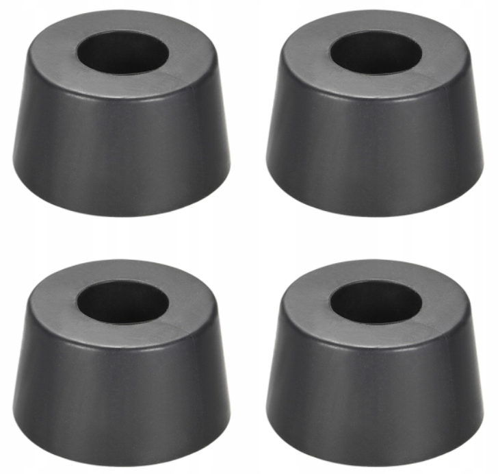
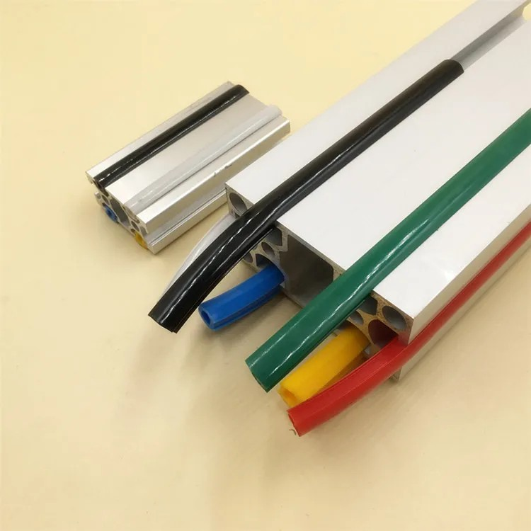
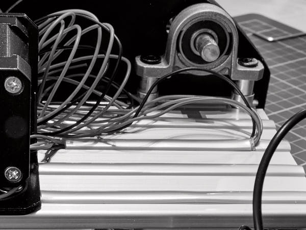
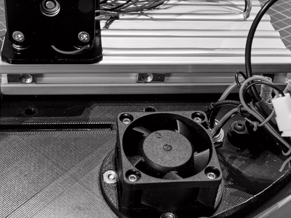

# Подготовка к монтажу крышки

## Установка ножек

**Понадобится:**

- Рама в сборе с валами и двигателем  
- Гайки профильные пружинные **M5** — 4 шт  
- Винты **M5×10** — 4 шт  
- Ножки виброгасящие для профиля 2020  
  *(ANTI-VIBRATION RUBBER FEET 2020 LEGS)* — 4 шт  
  

**Порядок действий:**

- Вставьте гайки в нижние пазы лонжеронов (по две с каждой стороны)  
- Прикрутите ножки винтами M5×10  
- Выставьте ножки так, чтобы они не выступали за края профиля  
- Затяните винты

## Подготовка двигателя

**Понадобится:**

- Рама в сборе с валами и двигателем

Двигатель **17HS19-2004S1** поставляется без шлейфового разъёма. Провода выведены  
напрямую из корпуса и подключаются в колодку для драйвера. Такая конфигурация не  
позволяет подключиться к винтовым клеммам контроллера.

**Необходимо:**

- Срезать колодку вместе с частью проводов  
- Укоротить провода на ~25 см от выхода из двигателя

## Укладка проводов двигателя

**Понадобится:**

- Молдинг (Slot Cover Seal Profile Flat 2020), длина 4 м  
  

**Порядок действий:**

1. Уложите молдинг в **все верхние пазы моторной площадки** — вставляйте цельным  
   куском от рулона и обрезайте по месту  
2. В **третьем слева пазу** — надрежте молдинг чтобы можно было вывести провода (см фото)  
3. Пропустите провода двигателя через зазор между частями молдинга  
4. Оставьте выступающими **примерно 15 см** провода со стороны паза  
5. Излишки аккуратно уложите **под двигателем**  
6. Установите оба фрагмента молдинга на место  
   

## Подготовка проводов двигателя к подключению

**Понадобится:**

- Концевые гильзы **EN0508 0.5 mm²** — 4 шт  
- Обжимные клещи (10–26 AWG)

**Порядок действий:**

1. Снимите 8 мм изоляции с каждого провода  
2. Наденьте гильзы  
3. Обожмите провод в гильзе клещами  
4. Укоротите гильзы до **5 мм**

> 💡 Обжим лучше производить **после укладки в молдинг** — гильзы затрудняют  
> протяжку через паз.

## Установка левой стенки

**Понадобится:**

- Гайки профильные пружинные **M5** — 3 шт  
- Винты **M5×10** — 3 шт  
- Рама в сборе с валами и двигателем  
- Подготовленная стенка `LeftWall.stl`

**Порядок действий:**

1. Вставьте гайки в торцевой профиль моторной площадки  
2. Приложите стенку, совместите отверстия с гайками  
3. Примерьте посадку — стенка должна надеваться **без усилий**  
   - Если стенка не садится — аккуратно доработайте пазы острым ножом  
   - Погрешности до ±0.4 мм возможны при распиле профиля  
4. Убедитесь в совмещении отверстий и гаек — подправьте положение при необходимости  
     
5. Закрепите стенку винтами **M5×10**, затяните

## Установка молдинга

**Понадобится:**

- Молдинг (Slot Cover Seal Profile Flat 2020)

Закройте все пазы профилей по периметру конструкции, **кроме верхних пазов**  
лонжеронов **за поперечной платформой** — они будут использоваться позже.

## Установка стопора

**Понадобится:**

- Гайки профильные пружинные **M5** — 2 шт  
- Винты ручной затяжки **M5×12**  
  *(Hand Tighten Curtain Wall Lock Screw GB834 DIN 464) **M5×12** * — 2 шт  
- Стопор `TankLimiter.stl` в сборе

**Порядок действий:**

1. Вставьте гайки в верхние пазы лонжеронов  
2. Совместите стопор с отверстиями  
3. Закрепите стопор винтами  
   

## Установка заглушек

**Понадобится:**

- Пластиковые заглушки на профиль **2020** — 4 шт  
- Пластиковые заглушки на профиль **2040** — 2 шт

**Установка:**

- Установите заглушки **2020** на торцы лонжеронов  
- Установите заглушки **2040** на торцы поперечной платформы
