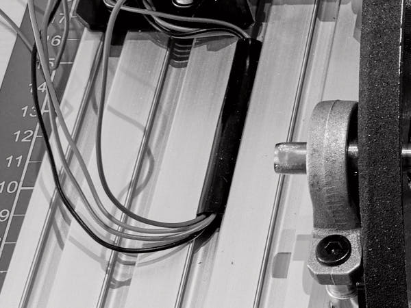

# Подготовка к монтажу крышки

## Установка ножек

Понадобится:
- рама в сборе с валами и двигателем
- ножки для профиля 2020 виброгасящие (ANTI-VIBRATION RUBBER FEET 2020 LEGS) - 4шт
- Гайка профильная пружинная **M5** — 4шт.  
- Винт **M5×10** — 4шт.  
  

- Установите гайки в нижние прорези лонжеронов с каждой стороны.
Прикрепите ножки к гайкам винтами M5
Спозиционируйте ножки так, чтобы они не выходили за края лонжеронов.
Затяните винты

## Подготовка двигателя

Понадобится:
- рама в сборе с валами и двигателем

Двигатель **17HS19-2004S1** выпускается без шлейфового разьема. Длинные провода выходят из корпуса двигателя
и заведены в колодку для установки на драйвер. Эта схема не позволяет подключить двигатель к винтовым клеммам контроллера.
Потому колодку нужно срезать с частью проводов укоротив провода на 25см.

## Укладка проводов двигателя

Понадобится:
- Молдинг (профиль-заглушка пазов) — Slot Cover Seal Profile Flat 2020, длина 4 м

Уложите молдинг во все верхние пазы моторной площадки. При укладке встявляйте молдинг от всего рулона и потом обрезайте в размер.

