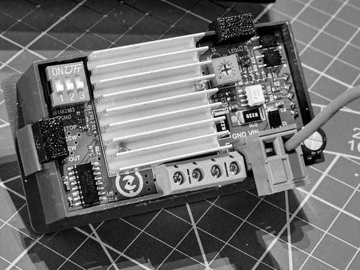
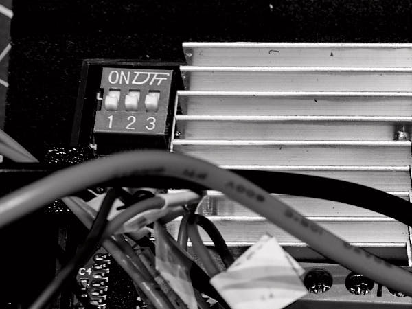
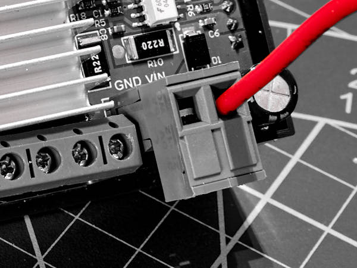
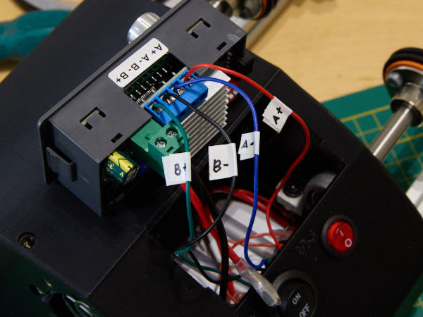
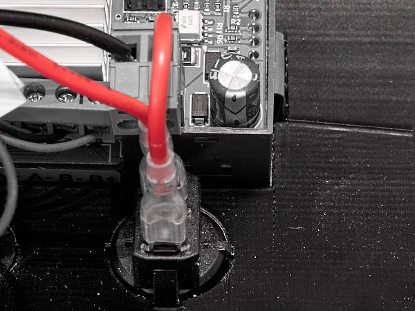

## Подготовка верхней крышки

### Осмотр модуля SMC02

> Примечание для опытных пользователей:  
> Платы модулей **SMC02** часто поставляются с остатками флюса, особенно в районе  
> разъёмов и кнопок. Некоторые энтузиасты аккуратно извлекают плату из корпуса  
> и промывают её изопропиловым спиртом. Это может повысить надёжность и предотвратить  
> случайные срабатывания. Однако данный шаг требует аккуратности и **не обязателен** —  
> при обычной эксплуатации модуль работает стабильно без дополнительной промывки.

Плата модуля обычно зафиксирована **каплями термоклея**. Иногда плата поставляется  
не зафиксированной. В этом случае воспользуйтесь фиксаторами  
`ControllerPCB_Fixer.stl`, подрезав их по размеру для плотной посадки. Фиксаторы  
можно закрепить суперклеем или проволочной скруткой по намеченным отверстиям.

**Расположение фиксаторов:**  

### Конфигурирование модуля SMC02

Переведите все DIP-переключатели в положение **OFF** — это включит делитель драйвера  
в режим **1/32**.

### Установка переключателей

**Понадобится:**

- Отпечатанная заготовка крышки `TopCover.stl`
- Переключатель вентилятора `KCD1-108R (rocker switch)`
- Переключатель питания контроллера `SPST 20 мм` (mini round switch)

Установите кнопки в соответствующие гнёзда. Кнопки входят плотно,  
возможна посадка с усилием.

### Подключение модуля SMC02

Подключите **участок A3** к клемме **питания контроллера**.

Ко второй клемме питания подключите **участок B1**.  
Надёжно затяните винты клемм.

Подключите провода двигателя:

- Красный — A+  
- Синий — A−  
- Чёрный — B+  
- Зелёный — B−

Проверьте надёжность крепления всех проводов — с лёгким усилием потяните  
их за изоляцию. При необходимости — перезажмите.

Установите модуль в посадочное место крышки.

### Подключение кнопок питания

Подключите свободные клеммы **участков A2 и A3** к кнопке **питания контроллера**  
(большие клеммы 6.3F). Очерёдность подключения не имеет значения.

Подключите свободные клеммы **участков A2 и A4** к кнопке **вентилятора**  
(маленькие клеммы 4.3F). Очерёдность подключения также не имеет значения.

### Укладка проводки и подключение вентилятора

Положите крышку на правую стенку так, чтобы около вентилятора оставалось  
достаточно пространства для укладки проводов.

Соберите проводку в пучки с помощью проволочных стяжек. Внутри корпуса  
мало места — старайтесь проложить провода так, чтобы они **не касались**  
лопастей вентилятора.

Уложите основной пучок проводов **под корпусом модуля SMC02**.

Подключите вентилятор к разъёму **JST XH 2.54, 2-pin**.  
Излишки проводов аккуратно уложите и зафиксируйте внутри крышки.

