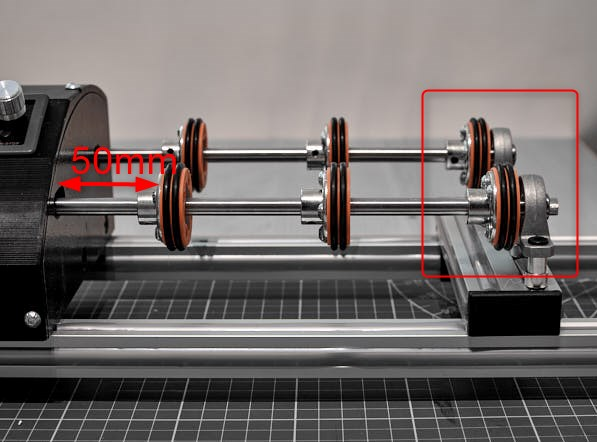
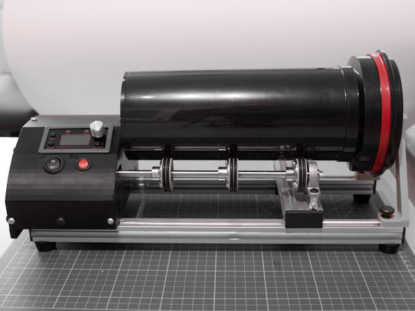
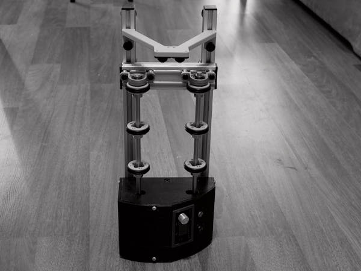

## Установка крышки

**Понадобятся:**
- Винт **M4×8** — 6 шт.

Установите крышку на верхние торцы боковых стенок и закрепите её винтами.  
Не затягивайте винты чрезмерно, чтобы не повредить резьбовые вставки.

## Установка боковых ножек

**Понадобятся:**
- Силиконовые бамперы (Silicone cabinet bumpers / Rubber Furniture Pads)  
  размером 2×5 мм или 3×8 мм — 4 шт. или больше

Приклейте силиконовые ножки на боковую стенку,  
чтобы агитатор можно было удобно ставить и хранить в вертикальном положении.

**Вид стенки:**

## Расстановка колёс на валах

**На каждом валу:**
- Первое колесо установите на расстоянии **50 мм** от боковой стенки.
- Последнее колесо разместите **вплотную к опорному подшипнику** не касаясь его.
- Остальные колёса распределите **равномерно между ними**.
- Зафиксируйте все колёса стопорными винтами.

**Расположение колес**

## Финальные иллюстрации

**Агитатор с бачком на 3 плёнки (стопор придвинут):**

**Агитатор с бачком на 5 плёнок (стопор отодвинут):**

**Агитатор в вертикальном положении для хранения:**

**Сборка завершена.** 
