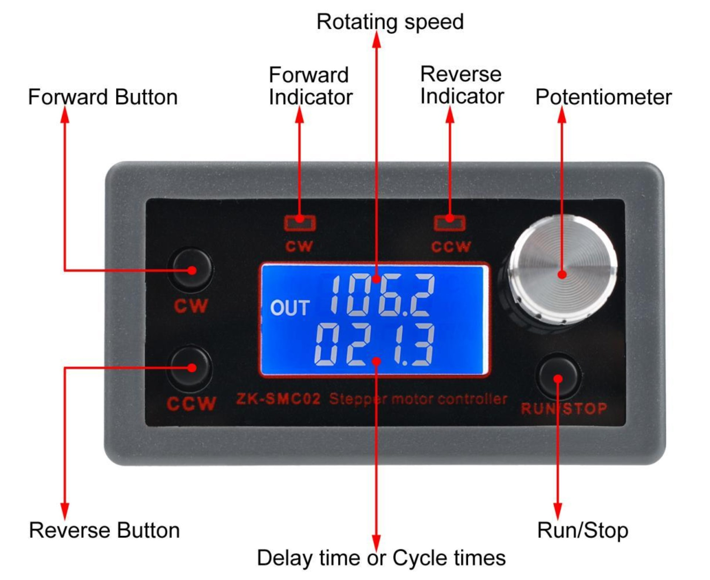

## Управление контроллером SMC02 (шаговый двигатель)

Контроллер шагового двигателя **SMC02** позволяет управлять вращением двигателя: 
настраивать скорость, направление и циклический режим работы. Ниже приведена краткая 
инструкция по эксплуатации.

### 1. Основной экран

- **Верхняя строка** — текущая скорость вращения (об/мин).  
- **Нижняя строка** — пауза между циклами или задержка (по F-10).  
- **CW** — запуск вращения вперёд (по часовой стрелке).  
- **CCW** — запуск вращения назад (против часовой стрелки).  
- **RUN/STOP** — запуск и остановка.  
- **Поворот ручки** — изменение скорости.  
- **Удержание ручки 3 сек** — вход в режим настройки.

---

### 2. Режим настройки параметров

Контроллер шагового двигателя **SMC02** позволяет настраивать вращение двигателя:  
вперёд/назад, с задержками, с повторением. Интерфейс выглядит необычно —  
но устроен он **как стиральная машина**: есть «ручки», только они называются не  
«отжим» и «стирка», а `F-02`, `F-05` и т.п.

Под каждой «ручкой» скрывается значение — скорость, число оборотов,  
задержка между сменами направления. Всё это настраивается с панели управления.

1. Поверните ручку, чтобы выбрать параметр (`F-01`...`F-13`).  
2. Нажмите ручку — перейдёте к редактированию значения.  
3. Есть два способа изменить значение:
   - **Прямой** — вращайте ручку и подтверждайте.  
   - **Разрядный** — нажмите ещё раз: мигает цифра. Меняйте её отдельно.  
4. После установки — нажмите `RUN/STOP` для выхода.  
5. Чтобы **сохранить и выйти** — удерживайте ручку 3 сек.

---

## Таблица параметров

| Параметр | Назначение                                                   | Диапазон         | По умолчанию |
|----------|--------------------------------------------------------------|------------------|--------------|
| F-01     | Выбор режима работы (см. таблицу режимов ниже)              | P01 ~ P09        | P01          |
| F-02     | Кол-во шагов вперёд (старшие 3 разряда + младшие 4)         | 1 ~ 9 999 999    | 1600         |
| F-03     | Скорость вперёд (об/мин)                                     | 0.1 ~ 999.9      | 10           |
| F-04     | Кол-во шагов назад (аналогично F-02)                         | 1 ~ 9 999 999    | 1600         |
| F-05     | Скорость назад (об/мин)                                      | 0.1 ~ 999.9      | 10           |
| F-06     | Кол-во повторений цикла (или бесконечно)                    | 0 ~ 9999 или ∞   | 1            |
| F-07     | Пауза после вращения вперёд (сек)                            | 0.0 ~ 999.9      | 0.0          |
| F-08     | Пауза после вращения назад (сек)                             | 0.0 ~ 999.9      | 0.0          |
| F-09     | Число импульсов на 1 оборот. Ед. измерения — *10            | 1 ~ 9999         | 160          |
|          | Пример: 360° / 1.8° / 8 = 25; 25 × 10 = 250                  |                  |              |
| F-10     | Режим дисплея:                                               | 0 или 1          | 0            |
|          | 0 — скорость / задержка, 1 — скорость / число циклов        |                  |              |
| F-11     | Как остановится мотор при STOP: 0 — плавно, 1 — сразу       | 0 или 1          | 0            |
| F-12     | Уровень ускорения/замедления (001 = плавно, 100 = резко)    | 001 ~ 100        | 020          |
| F-13     | Адрес устройства (если используется несколько устройств)     | 001 ~ 255        | 001          |

---

## Замечания

- Все параметры можно менять без пайки и программирования.  
- После настройки система работает как обычная бытовая техника.  
- Двигатель вращается только когда нажата кнопка RUN.  
- Остановить и повторно включить мотор можно в любой момент.  
- Режимы `F-01` описаны отдельно — выбирайте нужный под задачу.
