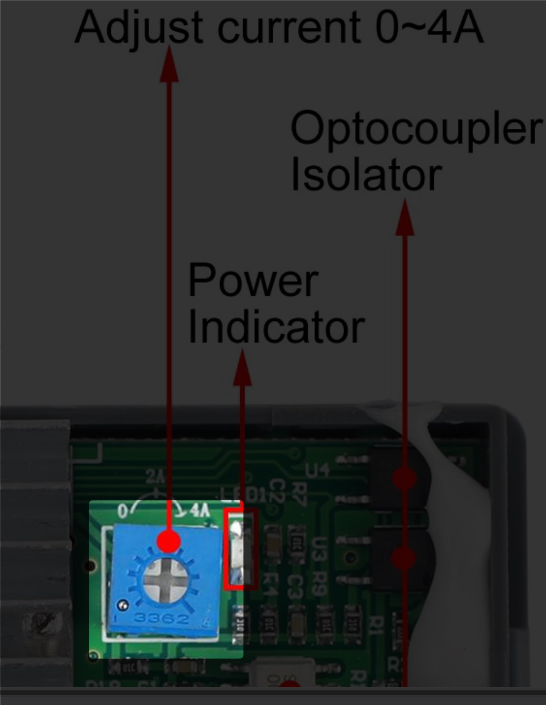

# Контрольный запуск и настройка валов

После сборки системы необходимо выполнить первичный запуск, убедиться в 
работоспособности всех компонентов и произвести точную наладку.

## Подача питания

1. Подключите блок питания к контроллеру через адаптер.
2. Вставьте вилку в розетку и включите питание.
3. Дисплей контроллера должен загореться.  
   Если этого не произошло:
   - Убедитесь, что питание действительно подаётся (светится индикатор питания на адаптере).
   - Убедитесь, что предохранитель целый и установлен в гнездо до конца
   - Проверьте подключение всех проводов.
   - Визуально проверьте, что разъёмы сидят плотно, контакты не перекручены 
     и не вырваны.

## Проверка вентилятора

1. Включите питание вентилятора.
2. Проверьте, что воздух выходит наружу (можно рукой).  
   Если поток воздуха направлен внутрь корпуса:
   - Отключите питание.
   - Разверните вентилятор в соответствии со стрелкой направления потока на его корпусе.

> Направление установки указывалось при сборке.

## Настройка контроллера

1. Введите параметры из таблиц предыдущей главы.
2. Убедитесь, что значения `F-01` … `F-12` заданы в соответствии с выбранной моделью 
   кольца (38 или 40 мм).
3. Проверьте скорость на дисплее:
   - Для **варианта A** — значение `9`
   - Для **варианта B** — значение `3`

## Проверка вращения и базовый тест

1. Установите проявочный бачок, заполненный водой.
2. Нажмите кнопку `CW` или `CCW` — начнётся вращение в заданную сторону.
3. Нажмите `Run/Stop` для остановки.
4. Снова нажмите `CW` или `CCW`, чтобы убедиться в повторяемости запуска.

## Проверка тяги

- Вращение должно быть плавным, без рывков или застреваний.
- Если двигатель "не тянет" (движение рваное, вращение прерывается):
  1. Отключите питание.
  2. Найдите регулятор тока (потенциометр) на контроллере.
  3. Аккуратно поверните его **вправо на одно деление** с помощью отвертки.
     
  4. Включите питание и повторите проверку.

> ⚠️ Избыточный ток может привести к перегреву драйвера. Регулируйте умеренно.

## Центровка бачка

- За 3–5 минут вращения бачок должен **медленно доехать до упора**.
- Если он слишком сильно упирается в ограничитель:
  - Сместите **опорный подшипник** ближе к ведущему валу (на ~0.5 мм).
 - Если бачок, наоборот, не доезжает или уходит в сторону:
     - Переместите подшипник в **обратную сторону**, ближе к краю платформы.

Чтобы сместить подшипник:

1. Ослабьте крепёжные винты.
2. Аккуратно передвиньте блок подшипника.
3. Затяните винты, не перетягивая.

## Завершение

Система готова к работе.  
Перед первой реальной проявкой убедитесь, что:

- вращение стабильное,
- двигатель не шумит и не замирает,
- бачок не болтается и не перекатывается.

При необходимости выполните повторную мелкую корректировку положения вала 
или значения тока.
